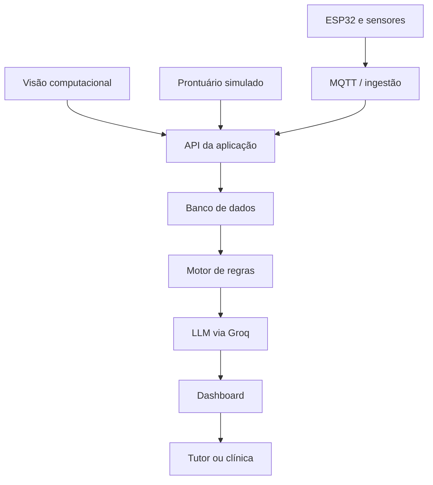

# Clyvo Monitor IoT — Proposta de Inteligência Artificial

**Sprint 3 — Disruptive Architectures: IoT, IoB & Generative IA**

## Integrantes

- Pedro Henrique dos Santos Costa — RM562156
- Eduardo Augusto de Oliveira Souza — RM565269
- Fellipe Costa de Oliveira — RM564673
- Felype Ferreira Maschio — RM563009
- Gustavo Vieira de Matos — RM563304

## Visão geral

A Clyvo Monitor IoT será uma plataforma proativa de acompanhamento da saúde e do bem-estar do pet. A solução utilizará informações clínicas, comportamentais e ambientais para priorizar cuidados e apresentar recomendações claras ao tutor, sem substituir a avaliação do médico-veterinário.

Esta Sprint 3 documenta o componente inteligente que será integrado à aplicação e apresenta um protótipo local do motor de regras. A API, o banco de dados, a integração real com a Groq e a validação completa permanecem planejados para a Sprint 4.

## Evolução em relação à Sprint 2

Na Sprint 2 foram desenvolvidos dois componentes que servirão como fontes de dados:
        
- ESP32 com sensores de temperatura, umidade e luminosidade, enviando leituras por MQTT;
- visão computacional com OpenCV e classificação de padrões comportamentais.

Na Sprint 3, esses dados passam a compor uma arquitetura maior, junto ao prontuário do pet. Um motor de regras prioriza ações de maneira determinística e auditável. Em seguida, um LLM via API da Groq transforma o resultado em uma orientação personalizada e acessível.

## Problema tratado

O acompanhamento do pet depende muito da iniciativa do tutor. Vacinas podem atrasar, consultas preventivas podem ser adiadas e alterações comportamentais podem passar despercebidas. A proposta cruza os dados disponíveis para indicar o que merece atenção, explicar o motivo e informar a urgência.

## Abordagem de IA

A arquitetura possui duas camadas:

1. **Motor de regras inteligentes:** recebe dados validados, identifica situações relevantes e determina prioridade, justificativa e ação sugerida.
2. **IA generativa:** recebe apenas a saída estruturada do motor de regras e a converte em uma mensagem natural. O LLM não define diagnóstico nem prioridade clínica sozinho.

## Arquitetura resumida



## Conteúdo do repositório

```text
sprint3-clyvo-vet/
├── README.md
├── docs/
│   └── sprint3-proposta-ia.md
├── exemplos/
    ├── prontuario_pet.json
│   └── recomendacao_simulada.json
├── src/
│   ├── main.py
│   └── motor_regras.py
└── tests/
    └── test_motor_regras.py
```

## Código-fonte da Sprint 3

O código implementa apenas a demonstração prevista para esta etapa:

- leitura de um prontuário simulado em JSON;
- validação dos campos obrigatórios;
- regras para comportamento, vacinas, consultas e ambiente;
- definição da maior prioridade encontrada;
- geração de evidências, ação sugerida e mensagem simulada;
- tratamento de arquivo inexistente, JSON inválido e dados incompletos.

Nesta Sprint, a mensagem é montada localmente por um modelo de texto determinístico. Nenhuma chamada à Groq é realizada. A integração com o LLM será desenvolvida na Sprint 4.

## Demonstração simulada

Os arquivos da pasta `exemplos` demonstram o fluxo planejado:

1. o prontuário, os sensores e a visão computacional fornecem os dados;
2. o motor de regras devolve uma ação priorizada e explicável;
3. a IA generativa produz uma mensagem apropriada ao tutor.

No protótipo da Sprint 3, a terceira etapa é representada por uma mensagem simulada e identificada como tal. Ela demonstra o formato esperado sem antecipar a integração generativa da Sprint 4.

## Como executar

### Pré-requisito

- Python 3.10 ou superior.

O protótipo utiliza apenas módulos da biblioteca padrão do Python. Não é necessário instalar dependências externas.

Na raiz do repositório, execute:

```bash
python src/main.py --data-referencia 2026-09-11
```

A data fixa reproduz o cenário acadêmico presente nos arquivos de exemplo. Sem esse argumento, o programa usa a data atual.

Para utilizar outro prontuário:

```bash
python src/main.py --entrada caminho/do/prontuario.json
```

Para salvar o resultado em outro arquivo JSON:

```bash
python src/main.py --data-referencia 2026-09-11 --saida recomendacao.json
```

### Executar os testes

```bash
python -m unittest discover -s tests -v
```

## Tecnologias previstas

- Python;
- API REST da aplicação Clyvo Monitor IoT;
- JSON;
- banco de dados da aplicação ou armazenamento simulado durante o protótipo;
- MQTT para dados ambientais;
- OpenCV e Scikit-learn para dados comportamentais da Sprint 2;
- API da Groq para acesso ao LLM;
- dashboard da aplicação.

## Resultados parciais da Sprint 3

- problema de negócio e benefícios definidos;
- fontes e estruturas dos dados documentadas;
- arquitetura entre sensores, aplicação, regras e LLM modelada;
- prontuário e recomendação de exemplo disponibilizados em JSON;
- motor de regras demonstrativo executável;
- priorização e justificativas rastreáveis;
- testes automatizados do cenário principal e da validação dos dados;
- limitações, privacidade e tratamento de falhas documentados.

O protótipo serve para validar o fluxo e a lógica proposta. Ele não representa uma IA clínica pronta nem a implementação final da Sprint 4.

## Segurança e limitações

- A solução oferece apoio informativo e não realiza diagnóstico veterinário.
- Situações críticas devem orientar o tutor a procurar uma clínica.
- O motor de regras é responsável pela prioridade; o LLM apenas redige a mensagem.
- Dados pessoais e clínicos devem seguir princípios da LGPD, como finalidade, necessidade, segurança e controle de acesso.
- Se o serviço generativo estiver indisponível, o sistema exibirá a mensagem estruturada produzida pelo motor de regras.

## Documentação e links

- Proposta completa: `docs/sprint3-proposta-ia.md`
- Exemplo de prontuário: `exemplos/prontuario_pet.json`
- Exemplo de recomendação: `exemplos/recomendacao_simulada.json`

O link do vídeo não listado será adicionado ao README antes da entrega final.
