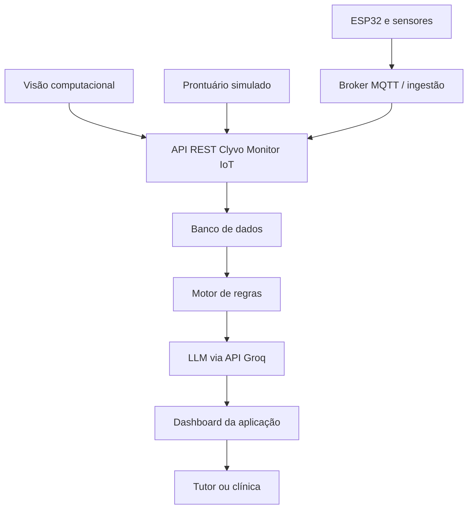

# Documentação da Proposta de IA — Clyvo Monitor IoT

**Sprint 3 — Disruptive Architectures: IoT, IoB & Generative IA**

## 1. Problema de negócio

O acompanhamento contínuo da saúde e do bem-estar do pet depende quase inteiramente da iniciativa do tutor: lembrar de agendar consultas, verificar se as vacinas estão em dia e perceber mudanças sutis de comportamento. Essa dependência gera dois riscos recorrentes: o esquecimento de cuidados preventivos e a demora na identificação de alterações comportamentais persistentes.

A proposta é transformar a Clyvo Monitor IoT em uma plataforma proativa. A solução cruza histórico clínico, dados comportamentais e dados ambientais para entregar recomendações priorizadas, no momento adequado e em linguagem acessível. Dessa forma, apoia o tutor no cuidado diário e ajuda a clínica no acompanhamento preventivo e na fidelização dos pacientes.

## 2. Valor entregue pela IA

### 2.1 Personalização

Cada recomendação considera o perfil individual do pet, incluindo espécie, idade, condições registradas, medicamentos, histórico de vacinas, consultas e rotina comportamental. Portanto, os alertas são contextualizados, e não apenas notificações genéricas.

### 2.2 Priorização de ações

Um motor de regras avalia critérios objetivos, como proximidade do vencimento de uma vacina, tempo desde a última consulta, alteração de atividade e exposição persistente a condições ambientais inadequadas. Cada ocorrência recebe prioridade `baixa`, `média`, `alta` ou `crítica`.

### 2.3 Apoio à decisão

A camada generativa converte a saída técnica do motor de regras em uma orientação compreensível: o que foi observado, por que merece atenção, qual ação é sugerida e com que urgência. A solução não substitui o médico-veterinário e não emite diagnóstico.

## 3. Relação com a Sprint 2

A Sprint 2 desenvolveu o monitoramento ambiental por ESP32/MQTT e um módulo de visão computacional para observar padrões de movimento e permanência em regiões como água, ração e cama. Na nova arquitetura, esses componentes permanecem como fontes de dados.

A Sprint 3 acrescenta a proposta de integração com prontuário, API, banco de dados, motor de regras e IA generativa. Como resultado parcial, inclui também um protótipo local do motor de regras que processa os arquivos JSON de exemplo. A implementação completa da arquitetura ocorrerá na Sprint 4.

## 4. Abordagem de IA escolhida

A proposta combina duas técnicas complementares.

### Camada 1 — Motor de regras inteligentes

Transforma dados clínicos, comportamentais e ambientais em ações estruturadas e priorizadas. Essa camada é determinística, auditável e explicável. Cada prioridade deve indicar quais condições acionaram a regra.

Exemplo de regra:

```text
SE baixa atividade persistir por pelo menos 3 dias
E o pet possuir condição clínica registrada
ENTÃO prioridade = alta
E ação = recomendar contato com a clínica
```

### Camada 2 — IA generativa via Groq

Recebe a saída estruturada e a converte em uma mensagem personalizada, curta e sem jargão técnico. O LLM não decide sozinho se uma situação é urgente e não deve inventar sintomas, tratamentos ou diagnósticos.

Essa combinação foi escolhida porque une rastreabilidade e segurança na decisão com clareza e personalização na comunicação.

## 5. Arquitetura e fluxo de dados



### Etapas do fluxo

1. O ESP32 publica temperatura, umidade e luminosidade em um tópico MQTT.
2. O serviço de ingestão valida o payload e encaminha os dados à API da Clyvo Monitor IoT.
3. O módulo de visão computacional envia métricas comportamentais à API.
4. A API relaciona os registros ao identificador do pet e armazena os dados.
5. O motor de regras consulta dados atuais e históricos e gera uma lista de ações priorizadas.
6. A API envia ao LLM somente o contexto necessário e a saída validada do motor de regras.
7. O LLM gera a mensagem, que é validada e exibida no dashboard.
8. Se a API generativa estiver indisponível, o dashboard apresenta a mensagem padrão do motor de regras.

## 6. API e armazenamento

Durante a Sprint 3, os dados clínicos podem ser representados por arquivos JSON simulados. Na implementação, a API REST da Clyvo Monitor IoT será o ponto central de integração.

Exemplos de rotas planejadas:

| Método | Rota | Finalidade |
|---|---|---|
| `POST` | `/api/pets/{petId}/ambiente` | Receber leitura ambiental validada |
| `POST` | `/api/pets/{petId}/comportamento` | Receber métricas comportamentais |
| `GET` | `/api/pets/{petId}/contexto` | Consultar contexto consolidado do pet |
| `POST` | `/api/pets/{petId}/recomendacoes` | Executar regras e solicitar a mensagem generativa |
| `GET` | `/api/pets/{petId}/recomendacoes` | Listar recomendações e respectivas prioridades |

Os nomes definitivos das rotas poderão ser ajustados à API existente na Sprint 4. O banco deverá registrar a origem, o instante da coleta e o identificador do pet, permitindo histórico e rastreabilidade.

## 7. Dados necessários

| Dado | Origem | Estrutura principal | Uso |
|---|---|---|---|
| Perfil do pet | Prontuário/API | ID, nome, espécie, idade e condições | Personalização |
| Vacinas | Prontuário/API | Tipo, última aplicação e próxima dose | Cálculo de urgência |
| Consultas | Prontuário/API | Data, motivo e observações autorizadas | Acompanhamento preventivo |
| Medicamentos | Prontuário/API | Nome, dosagem e período | Contexto e prevenção de orientações incompatíveis |
| Comportamento | Visão computacional | Classe, tempo parado, regiões, visitas e movimentos | Detecção de desvios persistentes |
| Ambiente | ESP32/MQTT | Temperatura, umidade, luminosidade e timestamp | Contextualização ambiental |
| Recomendação | Motor de regras/LLM | Prioridade, evidências, ação, mensagem e timestamp | Exibição e auditoria |

Cada payload deve possuir `pet_id`, `timestamp` e `origem`. A API deve rejeitar campos obrigatórios ausentes, formatos inválidos e registros sem autorização.

## 8. Exemplo simulado de funcionamento

### Entrada consolidada

```json
{
  "pet_id": "PET-001",
  "nome": "Luna",
  "condicoes": ["sobrepeso em acompanhamento"],
  "proxima_vacina": "2026-09-14",
  "ultima_consulta": "2025-10-10",
  "comportamento": {
    "classe": "baixa_atividade",
    "dias_persistentes": 3
  },
  "ambiente": {
    "temperatura_c": 31.2,
    "umidade_percentual": 64
  }
}
```

### Saída do motor de regras

```json
{
  "prioridade": "alta",
  "codigo_regra": "COMPORTAMENTO_PERSISTENTE_001",
  "evidencias": [
    "baixa atividade registrada por 3 dias",
    "temperatura atual de 31.2 °C",
    "vacina próxima do vencimento"
  ],
  "acao_sugerida": "entrar em contato com a clínica",
  "mensagem_padrao": "Foi identificada uma alteração persistente. Entre em contato com a clínica para orientação."
}
```

### Instrução enviada ao LLM

```text
Redija uma mensagem curta e acolhedora para o tutor. Use somente os dados
fornecidos. Informe a prioridade e a ação sugerida. Não dê diagnóstico,
não prescreva medicamentos e não invente informações.
```

### Mensagem gerada

```text
Luna apresentou uma redução de atividade nos últimos três dias, e a vacina
dela está próxima do vencimento. Como o ambiente também registrou temperatura
elevada, recomendamos entrar em contato com a clínica para receber orientação.
Esses sinais não representam um diagnóstico automático.
```

## 9. Segurança, privacidade e IA responsável

- **Finalidade e necessidade:** coletar apenas os dados necessários ao acompanhamento proposto.
- **Transparência:** informar ao tutor quais dados são usados e por que uma recomendação foi gerada.
- **Controle de acesso:** restringir prontuários e recomendações a usuários autorizados.
- **Segurança:** proteger dados em trânsito e armazenados e não registrar chaves da Groq no repositório.
- **Rastreabilidade:** armazenar regra acionada, evidências e instante da geração.
- **Supervisão humana:** encaminhar decisões clínicas ao veterinário.
- **Minimização no LLM:** enviar somente o contexto necessário, evitando dados identificáveis sem necessidade.
- **Prevenção de alucinações:** limitar o LLM à redação da saída produzida pelo motor de regras.

## 10. Tratamento de falhas

| Situação | Comportamento esperado |
|---|---|
| Groq indisponível | Exibir `mensagem_padrao` do motor de regras |
| Dados incompletos | Não gerar conclusão; indicar quais dados faltam |
| Payload inválido | Rejeitar e registrar erro de validação |
| Dados antigos | Informar que a recomendação usa dados desatualizados |
| Prioridade crítica | Exibir orientação para contato imediato com a clínica |

## 11. Benefícios esperados

### Para o tutor

- Orientações personalizadas e compreensíveis;
- redução de esquecimentos;
- melhor percepção de alterações persistentes;
- indicação clara da ação sugerida.

### Para a clínica

- apoio ao acompanhamento preventivo;
- priorização de contatos;
- histórico rastreável das recomendações;
- fortalecimento do relacionamento com o tutor.

### Para o pet

- maior continuidade dos cuidados;
- identificação antecipada de situações que merecem avaliação profissional;
- melhor contexto ambiental e comportamental para o acompanhamento.

## 12. Resultados parciais e próximos passos

Como resultados anteriores, já existem protótipos de monitoramento ambiental com ESP32/MQTT e de análise comportamental por visão computacional. Nesta Sprint 3 foram definidos o problema, os dados, as regras, a camada generativa e a arquitetura. Também foi criado um protótipo executável que lê o prontuário simulado, aplica regras de comportamento, vacinação, consulta e ambiente, e produz uma recomendação estruturada.

O protótipo da Sprint 3 não utiliza banco, API ou Groq e não realiza diagnóstico. Na Sprint 4, o motor de regras será integrado aos contratos da API, ao armazenamento, à Groq e ao dashboard, com ampliação dos testes para cenários integrados.
